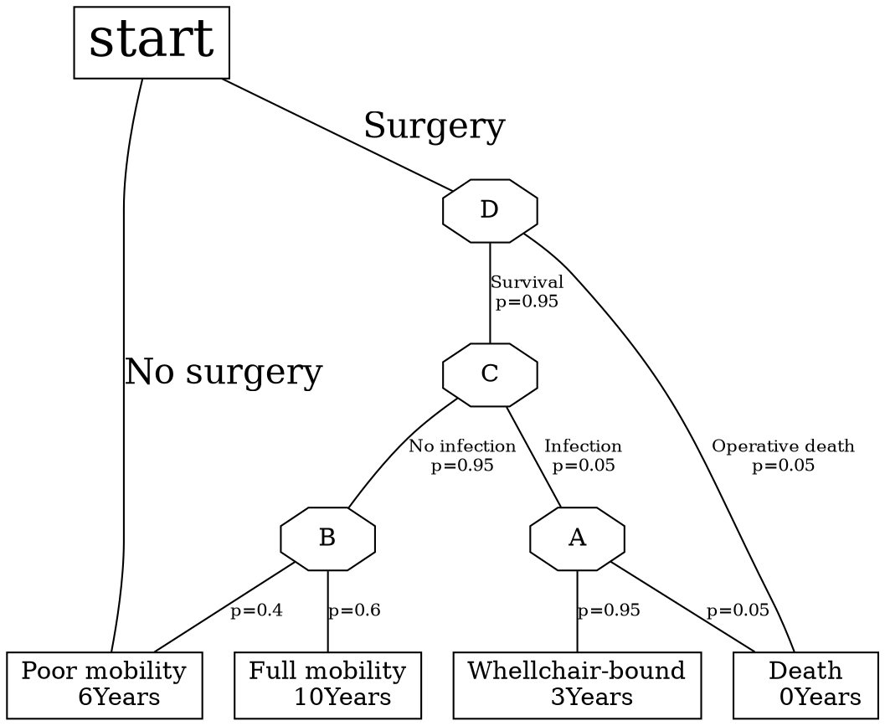

# 醫學資訊概論3.Biomedical Decision Making-Probabilistic Clinical Reasoning

[簡報在這裡](https://elearn2.fju.edu.tw/course/234105/learning-activity#/1242096)
## 小考題目及解答:
- 選擇題
    1. Which is not a nature(characteristic,特性)of clinical data?
    - [ ] Uncertain
    - [ ] Imprecision 
    - [X] certain and precision
    - [ ] Fuzziness
    2. Which is to measure the likelihood that a diseased patient has a negative test result?
    - [X] false-nagative(FNR)
    - [ ] prevalence
    - [ ] true-nagative rate(TNR)
    - [ ] true-positive rate(TPR)
    3. Which is more correct statement about 'probability' referring to?
    - [ ] degress of incompleteness 
    - [X] degrees of certainty
    - [ ] degrees of consistency
    4. Which is correct statement about 'prior probability' or called pretest probability?
    - [X] The probability that a clinician makes an initial judgement(hypotheses) only based on what he or she knows from talking with the patient.
    - [ ] The probability that a clinician makes an initial judement(hypotheses) after he or she performs a diagnostic test such as a blood test.
    - [ ] The probability that a clinician makes a refine judgement(hypotheses) only based on what he or she knows.
    5. Which is correct statement about 'post-test probability' or called 'posterior probability'?
    - [ ] The probability that a clinician makes an initial judgement(hypotheses) only based on what he or she knows from talking with the patient.
    - [ ] The probability that a clinician makes an initial judement(hypotheses) after he or she performs a diagnostic test such as a blood test.
    - [X] The probability that a clinician makes a refine judgement(hypotheses) after he or she performs a diagnostic as a blood test.
    6. 疾病檢測(Test)結果，特異性(specificity)指的是下列哪一種？
    - [ ] true-positive
    - [X] true-negative rate
    - [ ] flase-positive
    - [ ] flase-negative rate
    7. 疾病檢測結果，敏感性(sensitivity)指的是下列哪一種？
    - [X] true-positive
    - [ ] true-negative rate
    - [ ] flase-positive
    - [ ] flase-negative rate
    8. 疾病檢測結果，流行(盛行)率(prevalence rate)的計算式是下列哪一種？
    - [ ] True negative/(Total test populstion)
    - [ ] True positive/(Total test population)
    - [ ] Total pretest negative/(Total test population)
    - [X] Total pretest positive/(Total test population)
    9. Which step of decision analysis means "to test the conclusions of the analysis"?
    - [X] Use sensitivity analysis
    - [ ] Calculate the expected value of each decision alternative
    - [ ] Choose the decision alternative with the highest expected value
    - [ ] Create a decision tree
    10. Which is an incorrect statement about hypothetico-deductive(假設-推論) approach(HDA) to treat patient's illness(治療病人的疾病)？
    - [ ] It is an iteration process and sequential, staged data collection, followed by data interpretation and the generation of hypotheses.
    - [X] The goal often can not narrow/generate a single diagnosis which serves as the basis for providing a more certainty of treatment to the patient.
    - [ ] It is a process of medical data collection and treatment id intimately tied to an ongoing process of hypothesis generation and refinement.
    11. Which is a method commonly used for representing and comparing the expected outcomes(期望結果)of each decision alternative
    - [ ] The threshold probility 
    - [x] Decision tree 
    - [ ] Decision forest 
    - [ ] Bayes'theorem
- 計算題
1. The polymerase chain reaction (聚合酶酵素連鎖反應)test, 簡稱PCR test 為一種基因改造生物檢測法, is a gene-amplication technique that can diagnose HIV test 目前改良後作為COVID-19的檢測。
 
    | PCR test  |COVID-19檢測 為正常總人數|COVID-19檢測 為不正常總人數|
    | --------- | -------- | -------- |
    |檢測結果為正常|  160 TN  |   20 FP  |
    |檢測結果為異常|   40 FN  |   80 TP  |
    
    根據上表檢測結果，分別計算下列三項檢測效能指標(計算至小數一位)。
    A) True-positive rate(TPR) =66.6%
    - $TPR= \frac{80}{80+40}=\frac{2}{3}$
    
    B) Ture-negative rate(TNR) =88.8%
    - $TNR= \frac{160}{160+20}=\frac{8}{9}$

    C) Prevalence檢測有病除以總數 =33%
    - $流行率= \frac{80+20}{160+40+20+80}=\frac{1}{3}$
    
    他們及其他檢測效能指標(Performance Indications) 之對應公式明列如下:
    - $TPR= \frac{TP}{TP+FN}$
    - $TNR= \frac{TN}{TN+FP}$
    - $prevalence(流行率)= \frac{TP+FP}{TP+FN+TN+FP}$
    - $PV+= \frac{TP}{TP+FP}$
    - $PV-= \frac{TN}{TN+TP}$
    - $Correctness(正確性)= \frac{TP+TN}{TP+TN+FN+FP}$

2. 根據以下決策樹(Decision Tree) ，計算Surgery之期望值並指出是否應進行Surgery?

A = 0.05x0+0.95x3=2.85
B = 10x0.6+6x0.4=8.4
C = Ax0.05+Bx0.95=8.1225
D = Cx0.95+0x0.05=7.716375
期望值=7.716375(年)>6(不做手術活6年)

Ans:要

###### tags: `Biomedical Informatics` `110` `2021`

