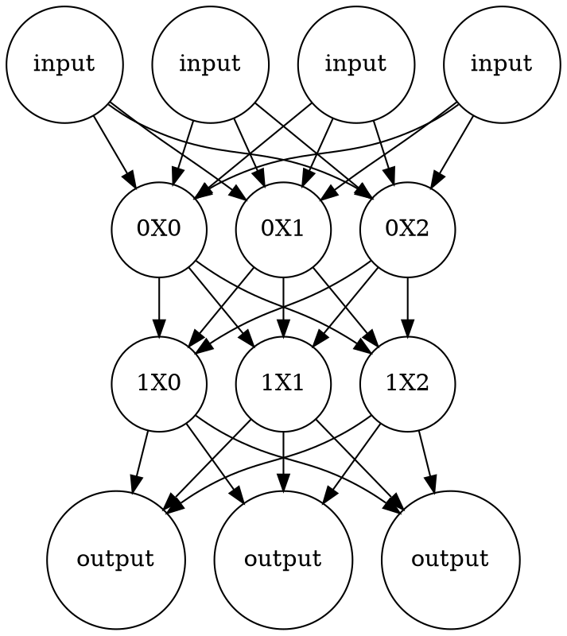

# 醫學資訊概論4.Big Data Analytics and AI for Decision Making in BI

[簡報在這裡](https://elearn2.fju.edu.tw/course/234105/learning-activity#/1242105)
## 小考題目及解答:
- 選擇題
    1. Which big data issue is to exam (test) large volumes of data from a variety of types and sourcess to uncover hidden patterns, correlation, trends,and so on?
    - [ ] big data management
    - [ ] big data control
    - [ ] big data gathering
    - [x] big data analytics
    2. Which big data issue focuses on the organization, administration and governance of large volumes of both structured and unstructured data?
    - [x] big data management
    - [ ] big data analytics
    - [ ] big data cleaning
    - [ ] big data computing
    3. Which are the major tasks of Map Phase in MapReduce operation?
    - [x] spilts & mapping
    - [ ] shuffling & reducing
    - [ ] mapping & reducing
    4. Which are the major tasks of Reduce Phase in MapReduce operation?
    - [ ] spilts & mapping
    - [x] shuffling & reducing
    - [ ] mapping & reducing
    5. Which does not a feature of big data?
    - [ ] variety
    - [ ] velocity
    - [x] volatile
    - [ ] veracity
    6. Which tools are used to scan massive data for discovering meaningful new correlations, patterns, and trends?
    - [ ] visualization tools
    - [x] data mining tools
    - [ ] virtual reality tools
    7. 以下哪一種人工智慧演算法具深度學習的特性?
    - [ ] 數學演算法
    - [x] 類神經網路
    - [ ] 專家系統
    - [ ] 決策樹
    8. 以下哪一種非深度學習的主要特徵?
    - [ ] 大量資料學習
    - [ ] 嚴謹的學習演算法
    - [ ] 需要快速運算能力
    - [x] 需要快速繪圖能力
    9. 哪一項不是應用類神經網路建立醫療決策系統的必要元素?
    - [ ] 歷史性案例
    - [ ] 深度學習機制
    - [x] 推論引擎
    - [ ] 系統建立相關人員
    10. 哪一種人工智慧技術具推論及解釋功能?
    - [ ] 決策樹
    - [x] 專家系統
    - [ ] 基因演算法
    - [ ] 倒傳遞類神經網路
    11. 哪一種人工智慧技術模仿生物競存法則而建立?
    - [ ] 機器人
    - [ ] 專家系統
    - [x] 遺傳演算法
    - [ ] 到傳遞類神經網路
    12. 哪一Google 雲端 BigTable (Google File System)存取架構之描述是不正確的?
    - [x] 他是一種關聯是SQL database
    - [ ] 較底層包含a set of distributed chunkservers
    - [ ] 儲存在chunkserver 的資料單元稱 "chunk"
    - [ ] 有一Master Process 維護metadata
    13. 下列何者不是大數據分析常用到的相關技術?
    - [ ] Internet of Things
    - [ ] Cloud computing
    - [ ] High-speed data communication such as 5G
    - [x] File organization and management
    14. 下列何者不是成為一位Data Scientist應具備的技能?
    - [ ] Data modeling and using AI tools for data analytics
    - [x] Natural science experiment
    - [ ] System deployment and data analytics on cloud platform such as Ammazon AWS
    - [ ] Information System Deevelopment and Coding skill for cloud computing
    15. 下列何者不是成為一位Data Analyist應具備的技能?
    - [x] Machine building skills
    - [ ] Data warehouse modeling skills
    - [ ] Communication skills
    - [ ] Data Visualization skills
    16. 下列何者不是大數據須面對之主要議題?
    - [ ] Big data analytics
    - [ ] Big data Technologies
    - [ ] Big data management
    - [x] 以上都須面對之議題
    17. 下列何者不是因應大數據分散儲存及分析發展的雲端資料儲存模式?
    - [x] Microsoft SQL
    - [ ] Google BigTable
    - [ ] Amazon RDB
    - [ ] Microsoft SQL Azure
    18. 下列何者不是NewSQL的產品?
    - [ ] Amazon RDB
    - [ ] MS SQL Azure
    - [x] my SQL
    - [ ] MySQL Cluster
    19. Which task (or activity) is used to insure that the dixision model of conducting big data analytics is reliably implement?
    - [x] evaluation
    - [ ] validation
    - [ ] verification
    - [ ] auditing

- 申論題
1. 請用一個可被清楚理解之架構圖(Diagram)描繪並簡要說明雲端運算機制MapReduce之平行運作模式，並簡要說明之。
 

2. 請分別簡述AI without Machine Learning, Machine Learning, Deep Machine Learning的概念，並個舉出幾個他們各自的主要應用。
- 應用:
    - AI:精準醫學、智慧醫院、心理健康、科技防疫、決策樹
    - Machine Learning:動物分類、客戶細分、購買傾向、（信用卡）欺詐檢測、3 年、5 年、10 年腦/乳腺癌/結腸癌存活率預測
    - Deep Machine Learning:AlphaGo、無人駕駛汽車
- 概念：
    - AI:計算機模仿人類思考進而模擬人類的能力/行為。

    - 機器學習 概念：機器學習採用了人工智能的一些核心思想，並將其重點放在使用神經網路去模仿我們的決策(從資料中學習模型），來解決現實生活的問題

    - 深度學習的概念：深度學習 更專注於機器學習的工具和技術，並將它們應用於解決幾乎任何需要“思考”（思考；推理）的問題。
  

3. 請用一個系統架構圖，表達專家系統建置所包含之系統功能元件(functional components)、領域專家、專家系統開發人員或知識工程師，他們在圖上有其功能之關聯性。

    

4. 請用圖描繪符合以下一倒傳遞類神經網路圖（Backpropagation Neural Network,BPNN):他至少包含兩層隱藏層(每層各含三個神經元(Neurons))，一可接受四種不同型態資料之輸入層，一可產生三種不同型態結果之輸出層。並說明其機器學習(machine learning)的原理

機器學習著重於訓練電腦從資料中學習，並根據經驗改進，而不是按照明確的程式碼運行作業。在機器學習中會訓練演算法尋找大型資料集的模式和關聯性，並根據該分析做出最佳決策和預測。機器學習應用程式會隨著使用不斷改善，存取的資料越多、準確度越高。

###### tags: `Biomedical Informatics` `110` `2021`

